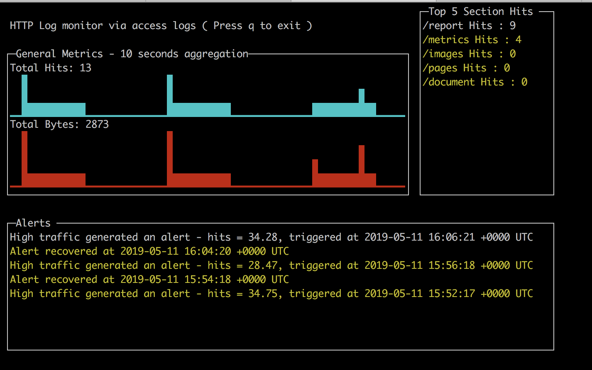

Application was developed using Golang , language that I have been using for about 2 year.
I am using go mod for the dependencies.


I could write the same in Java, but the final "binary" would be heavier than GO and we would need a lot of dependencies.


This app is split in two parts:

Monitoring :

1) Will tail the log and accumulate in counters the number of occurrences per section.
2) Will run every 10 seconds a routine to read the counter and compare with the previous observed value to find the number of hits during the 2 scraping times.
3) Will run every 2 minutes a routine to read the counter to trigger an alert if the Hits/s AVG is higher then the one received in the app arg.


Dashboard :

Will present the dashboard with the relevant information, updating the screen every 1 second (even if the collection is done in 10s and the alert 120s)


Testing:

The monitoring packaged is covered >85% using unit tests.

Didn't have time to cover more lines or create the unit test for the dashboard.


I also created a basic ( and ugly ) bash to append the log file to simulate the application server logging.

This will trigger the alert in the first 2 minutes and then recover it.


Application design improvement:

I would write my own "tail" using the system calls. 

I would also store the metrics in a time series database and display it correctly with a smart FE like Grafana. 


Running it:

Build the docker image:

```
docker build -t topineeu/logmonitor-homework .
```


This will produce a final docker image (from scratch) with less than 5 MB that contains the linux compiled binary.

To run, we need to have the TTY and STDIN open for the UI and we need also to mount the log file
```
docker run -i -t -v /tmp/access.log:/tmp/access.log topineeu/logmonitor-homework
```

The "integration test script" needs to be executed in another terminal in parallel with the monitoring application:

```
./test.sh
```


As requested, Ive added two args for the log location and the alert threshold :

```
apimenteldasilvatopi$ docker run -i -t -v /tmp/access.log:/tmp/access.log topineeu/logmonitor-homework --help
Usage of /app:
  -avg-threshold float
    	Total traffic threshold for alerting (hits/s) (default 10)
  -log-filename string
    	w3c-formatted HTTP access log to be consumed actively (default "/tmp/access.log")
    	
```

 
Feel free to contact for any additional information.


Thanks,
Anderson TOPINE 
  
